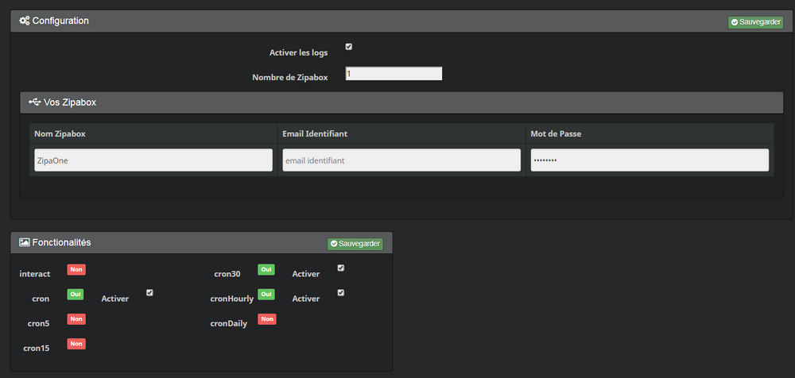
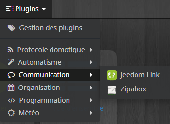
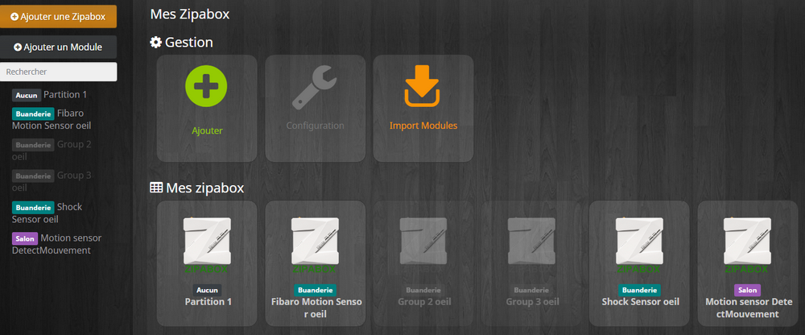
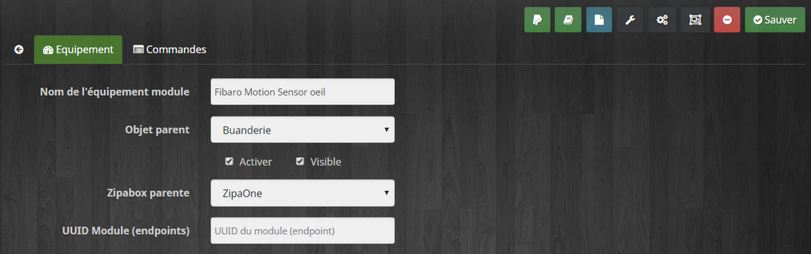
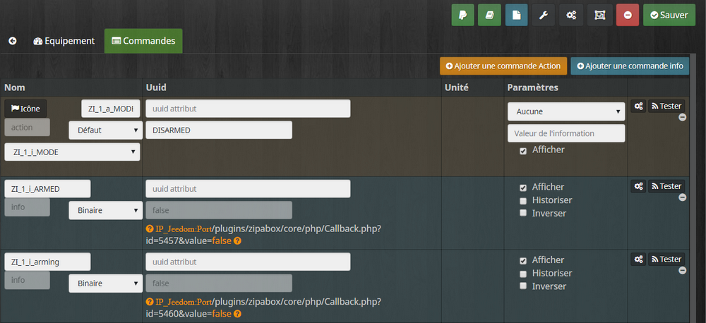
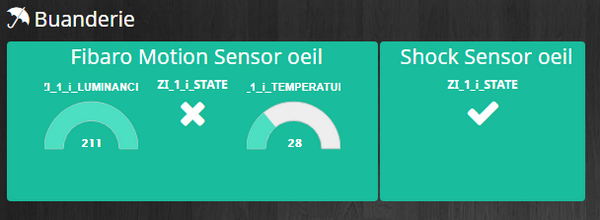

Description
===========
Zipabox v0.5alpha

Plugin permettant de communiquer avec la Zipabox et ses modules.

Installation et mise à jour du plugin
---

- Installation du plugin

   Après téléchargement du plugin sur votre Jeedom, il vous faut activer celui-ci.

-  Mise à jour du plugin

   RAS

Configuration du plugin
=======================

Sur la page configuration du plugin:

Onglet : Options
---
* Vous pouvez activer les logs (attention trés verbeux).

> [IMPORTANT]
> 
> Il n'est pas recommandé de laisser cette case en permanence cochée car cette option génère beaucoup d'écriture dans les fichiers de log.

> [NOTE]
> 
> Il faut aussi activer les logs de niveau "Debug" dans Jeedom ( Menu Configuration->Configuration des logs & messages ).

Vous pouvez indiquer le nombre de Zipabox que vous avez, 1 le cas échéant.

Onglet : Vos Zipabox
---
Veuillez renseigner un nom pour chaque, ainsi que l'email et le mot de passe qui permettent de se connecter à la Zipabox.

Onglet : Fonctionnalités
---

- Le cron (executé toutes les minutes) permet de récupérer l'état des commandes infos depuis les modules de la Zipabox.
- Le cron30 (executé toutes les 30 minutes) permet de maintenir active la connection à la Zipabox.
- Le cronHourly (executé toutes les heures) permet de vérifier si un module est toujours existant sur la Zipabox, et de maintenir actif ou non l'équipement dans Jeedom.

Création des équipements
========================

La configuration des équipements Zipabox est accessible à partir du menu Plugins / Communication: 

Voilà à quoi ressemble la page du plugin Zipabox (ici avec déjà des équipements) : 

> [NOTE]
> 
> Le bouton "Import Modules" permet d'importer tous les modules de la Zipabox, et de créer automatiquement les équipements et le commandes afférentes.
> *Ceci est expérimental, et des corrections manuelles sur les commandes peuvent être nécéssaires.*
> Les modules/équipements n'ayant pas de commandes sont créés mais laissés inactif.

Onglet : Equipements
---

> [TIP]
> 
> Comme à beaucoup d'endroits sur Jeedom, placer la souris tout à gauche permet de faire apparaître un menu d'accès rapide (vous pouvez, à partir de votre profil, le laisser toujours visible).

Une fois que vous cliquez sur le bouton (Ajouter un nouvel équipement), et après avoir donné un nom à votre équipement, vous obtenez : 

Vous retrouvez ici toute la configuration de votre équipement : 

* **Nom de l'équipement** : nom de votre équipement Zipabox,
* **Objet parent** : indique l'objet parent auquel appartient l'équipement,
* **Activer** : permet de rendre votre équipement actif,
* **Visible** : rend votre équipement visible sur le dashboard.
* **Zipabox** : Permet de choisir la Zipabox à laquelle appartient cet équipement.
* **UUID** : Numéro unique disponible sur le module (endpoint) dans votre Zipabox.

Onglet : Commandes
---

Vous avez 2 boutons permettant d'ajouter manuellement des commandes action ou info.
> [IMPORTANT]
> 
> Le champ UUID est obligatoire, et correspond à celui de l'attribut du module dans la Zipabox.

Le champ URL (http_request) peut vous permmttre de créer une régle push http_request  sur événement dans la Zipabox.
Cela est utile si la mise à jour automatique des infos toutes les minutes, n'est pas assez souvent pour vous.
*IP_Jeedom:Port* doit être remplacé par l'adresse d'accés à votre Jeedom depuis internet.
L'idéal dans ce cas étant d'utiliser les DNS fournis par Jeedom.

Widgets
=======

Ce sont ceux par défaut de Jeedom.

Les widgets desktop ressemblent à cela :

